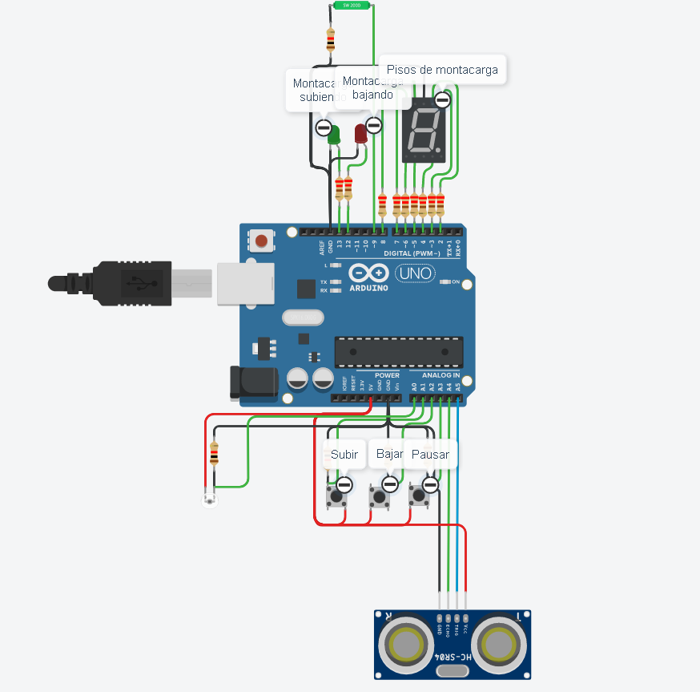
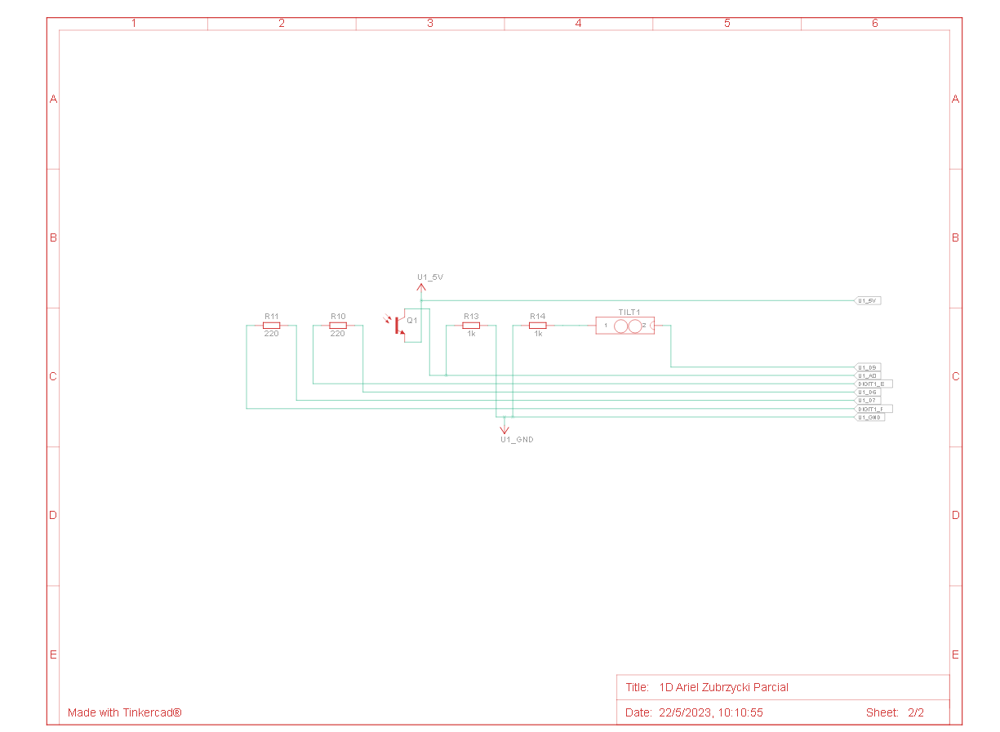

# Parcial 

## Integrantes 
- Ariel Zubrzycki 

## Proyecto: Montacarga

## Diagramas esquematicos:

## Descripción
Se nos pide armar un modelo de montacarga funcional como maqueta para un hospital. El
objetivo es que implementes un sistema que pueda recibir ordenes de subir, bajar o pausar
desde diferentes pisos y muestre el estado actual del montacargas en el display 7
segmentos.

## Requisitos del Parcial
1_Interfaz de usuario:
• Deberá haber 3 botones, uno para subir pisos, otro para bajar pisos y otro para
detener el montacarga.
• Deberá tener 2 LEDs, uno verde que indicará cuando el montacarga este en
movimiento, otro rojo que indique cuando el montacarga esté pausado.
• En el display 7 segmentos deberán informar en tiempo real en qué piso se
encuentra el elevador.
• Se sabe que el tiempo de trayecto entre pisos es de 3 segundos (3000 ms). •
Se deberá informar por monitor serial el piso en el que se encuentra el
montacarga, este en funcionamiento o en pausa.

2_Funcionamiento del montacarga:
• Implementa un algoritmo que permita que el elevador suba y baje o frene
presionando los botones correspondientes.
• Deberán buscar una forma para pausar el montacargas cuando el usuario lo
determine.

3_Documentación:
• Deberán presentar un diagrama esquemático del circuito y explicar el
funcionamiento aplicado de cada componente.
• Presentar el código fuente del proyecto de Arduino listo para ser
implementado.
• Deberán explicar el funcionamiento integral utilizando documentación
MarkDown.

4_Se debe agregar un sensor según el grupo y la funcionalidad que usted se imagine:
Photoresistor
Sensor Ultra sonico
SensorInclinado

~~~ C (lenguaje en el que esta escrito)
#define led_A 2
#define led_B 3
#define led_C 4
#define led_D 5
#define led_E 6
#define led_F 7
#define led_G 8
#define TRIGGER A5
#define ECHO  A4
#define VELOCIDAD_SONIDO 34300

float distancia;
int tiempo;
int cargaIngresada;
int piso = 0;
int botonAscender;
int botonDescender;
int botonPausa;
int ledRojo = LOW;
int ledVerde = LOW;
int photoresistor;
int dia;
int sensorTilt;
int cargaInclinada;

void setup()
{
  Serial.begin(9600);
  pinMode(A1, INPUT_PULLUP);
  pinMode(A2, INPUT_PULLUP);
  pinMode(A3, INPUT_PULLUP);
  pinMode(13, OUTPUT);
  pinMode(12, OUTPUT);
  pinMode(led_A, OUTPUT);
  pinMode(led_B, OUTPUT);
  pinMode(led_C, OUTPUT);
  pinMode(led_D, OUTPUT);
  pinMode(led_E, OUTPUT);
  pinMode(led_F, OUTPUT);
  pinMode(led_G, OUTPUT);
  pinMode(TRIGGER, OUTPUT);
  pinMode(ECHO, INPUT);
  pinMode(A0, INPUT);
  pinMode(9, INPUT);
  pinMode(10, OUTPUT);
  
  digitalWrite(led_A, HIGH);
  digitalWrite(led_B, HIGH);
  digitalWrite(led_C, HIGH);
  digitalWrite(led_D, HIGH);
  digitalWrite(led_E, HIGH);
  digitalWrite(led_F, HIGH); 	
}

void loop()
{
  botonAscender = digitalRead(A1);
  botonDescender = digitalRead(A2);
  botonPausa = digitalRead(A3);
  ledRojo = digitalRead(12);
  ledVerde = digitalRead(13);
  
  if(botonAscender == HIGH)
  {
    digitalWrite(12, LOW);
    digitalWrite(13, HIGH);
    Serial.println("El montacarga se Eleva");
  }
  
  if(botonDescender == HIGH)
  {
    digitalWrite(13, LOW);
    digitalWrite(12, HIGH);
    Serial.println("El montacarga Desciende");
  }
    
  if(botonPausa == HIGH)
  {
    digitalWrite(13, LOW);
    digitalWrite(12, LOW);
    Serial.println("El montacarga se Detuvo.");
  }
   
  delay(100);
  ambienteActual();
  
  if(dia == 1)
  {
  	estadoMontaCarga(ledVerde, ledRojo);
  }
}

void cargaBuenEstado()
{
  ingresoDeCarga();
  sensorInclinado();
  
  if(cargaIngresada == 0 || cargaInclinada == 0)
  {
    digitalWrite(12, LOW);
    digitalWrite(13, LOW);
    Serial.println("El montacarga no tiene ninguna carga encima o la carga esta inclinada");
  }
}

void sensorInclinado()
{
  digitalWrite(9, HIGH);
  cargaInclinada = digitalRead(9);
}

void ambienteActual()
{
  photoresistor = analogRead(A0);
    
  if(photoresistor == 13)
  {
    dia = 1;
  }
  else
  {
    dia = 0;
  }
}

void ingresoDeCarga()
{
  digitalWrite(TRIGGER, LOW);
  delayMicroseconds(2);
  digitalWrite(TRIGGER, HIGH);
  delayMicroseconds(5);
  digitalWrite(TRIGGER, LOW);
  tiempo=pulseIn(ECHO, HIGH);
  
  distancia = tiempo/2 * 0.000001 * VELOCIDAD_SONIDO;
  
  if(distancia > 100 && distancia < 200)
  {
    cargaIngresada = 1;
  }
  else
  {
    cargaIngresada = 0;
  }
}

void estadoMontaCarga(int ledVerde, int ledRojo)
{
  cargaBuenEstado();
  
  if(ledVerde == HIGH) // Led Ascender
  {
    subirPiso();
    delay(2900);
  }
  else
  {
    if(ledRojo == HIGH) // Led Descender
    {
      bajarPiso();
      delay(2900);
    }
  }
}
  
void subirPiso()
{
  if(piso > 8)
  {
    digitalWrite(13, LOW);
    Serial.println("El montacarga llego a su limite");
  }
  else
  {
    piso++;
  	Serial.print("El montacarga se encuentra en el piso ");
  	Serial.println(piso);
    pisoActual(piso);
  }
}
  
void bajarPiso()
{
  
  if(piso < 1)
  {
    digitalWrite(12, LOW);
    Serial.println("El montacarga llego a su limite");
    piso = 0;
  }
  else
  {
    piso--;
    Serial.print("El montacarga se encuentra en el piso ");
    Serial.println(piso);
    pisoActual(piso);
  }
}
  
void pisoActual(int piso)
{
  digitalWrite(led_A, LOW);
  digitalWrite(led_B, LOW);
  digitalWrite(led_C, LOW);
  digitalWrite(led_D, LOW);
  digitalWrite(led_E, LOW);
  digitalWrite(led_F, LOW);
  digitalWrite(led_G, LOW);

  switch(piso)
  {
    case 0:
      digitalWrite(led_A, HIGH);
      digitalWrite(led_B, HIGH);
      digitalWrite(led_C, HIGH);
      digitalWrite(led_D, HIGH);
      digitalWrite(led_E, HIGH);
      digitalWrite(led_F, HIGH); 	
      break;
    case 1:
      digitalWrite(led_B, HIGH);
      digitalWrite(led_C, HIGH);
      break;
    case 2:
      digitalWrite(led_A, HIGH);
      digitalWrite(led_B, HIGH);
      digitalWrite(led_D, HIGH);
      digitalWrite(led_E, HIGH);
      digitalWrite(led_G, HIGH); 
      break;
    case 3:
      digitalWrite(led_A, HIGH);
      digitalWrite(led_B, HIGH);
      digitalWrite(led_C, HIGH);
      digitalWrite(led_D, HIGH);
      digitalWrite(led_G, HIGH);
      break;
    case 4:
      digitalWrite(led_B, HIGH);
      digitalWrite(led_C, HIGH);
      digitalWrite(led_F, HIGH);
      digitalWrite(led_G, HIGH); 
      break;
    case 5:
      digitalWrite(led_A, HIGH);
      digitalWrite(led_C, HIGH);
      digitalWrite(led_D, HIGH);
      digitalWrite(led_F, HIGH); 
      digitalWrite(led_G, HIGH); 
      break;
    case 6:
      digitalWrite(led_A, HIGH);
      digitalWrite(led_C, HIGH);
      digitalWrite(led_E, HIGH);
      digitalWrite(led_D, HIGH);
      digitalWrite(led_F, HIGH);
      digitalWrite(led_G, HIGH); 
      break;
    case 7:
      digitalWrite(led_A, HIGH);
      digitalWrite(led_B, HIGH);
      digitalWrite(led_C, HIGH);
      break;
    case 8:
      digitalWrite(led_A, HIGH);
      digitalWrite(led_B, HIGH);
      digitalWrite(led_C, HIGH);
      digitalWrite(led_D, HIGH);
      digitalWrite(led_E, HIGH);
      digitalWrite(led_F, HIGH); 
      digitalWrite(led_G, HIGH);
      break;
    case 9:
      digitalWrite(led_A, HIGH);
      digitalWrite(led_B, HIGH);
      digitalWrite(led_C, HIGH);
      digitalWrite(led_D, HIGH);
      digitalWrite(led_F, HIGH); 
      digitalWrite(led_G, HIGH);
      break;
  }
}
~~~

## :robot: Link al proyecto
- [proyecto](https://www.tinkercad.com/things/cnA1IdGiebW-1d-ariel-zubrzycki-parcial/editel)

